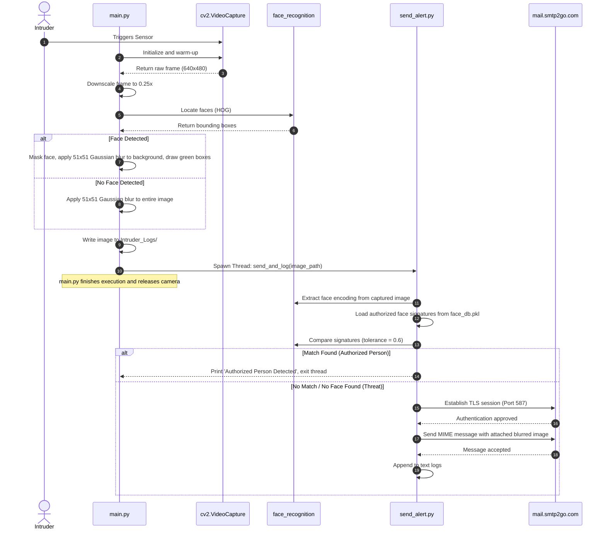

# 🛡️ Local Edge Intruder Detection System

[](https://www.python.org/)
[](https://opencv.org/)
[](https://github.com/ageitgey/face_recognition)
[](https://www.mysql.com/)
[](LICENSE)

An edge-based physical security application. The system monitors local camera feeds in real-time, isolates human faces using deep learning biometrics, applies selective privacy background blurring, and compares face signatures against a pre-serialized local cache of authorized individuals. If an unauthorized face or obscured activity is detected, the system executes asynchronous SMTP email dispatches containing blurred visual evidence and writes local audit logs.

> [!NOTE]  
> **Project State:** This repository is currently in a prototyping phase. It contains a primary operational path (`main.py`) alongside several disconnected, experimental modules for database logging (MySQL/SQLite) and alternative detection methods (Haar Cascades). 

---

## 📌 Table of Contents

- [Business Problem](#-business-problem)
- [System Architecture](#-system-architecture)
- [Folder Structure](#-folder-structure)
- [Technology Stack](#-technology-stack)
- [Installation & Setup](#-installation--setup)
- [Running the System](#-running-the-system)
- [AI Pipeline & Face Matching](#-ai-pipeline--face-matching)
- [Observability & SRE](#-observability--sre)
- [Security Assessment](#-security-assessment)
- [Subsystem Engineering Decisions](#-subsystem-engineering-decisions)
- [Testing & Verification](#-testing--verification)
- [Project Roadmap](#-project-roadmap)
- [License](#-license)

---

## 💼 Business Problem

Standard surveillance systems record video passively, requiring manual review post-incident. Cloud-based smart cameras solve this but introduce high subscription costs, privacy issues due to cloud storage of sensitive feeds, and network bandwidth overhead.

This local edge system addresses these issues by:
1. **Edge Biometrics**: Eliminating cloud costs by performing computer vision inference directly on the local machine.
2. **Zero-Trust Video Storage**: Retaining all video data on the physical device, sending only immediate threat alert images via secure SMTP.
3. **Instant Incident Awareness**: Dispatching visual proof to recipient inboxes within seconds of a physical breach.

---

## 🏗️ System Architecture

The following diagrams illustrate the core operational flow. *(Note: Database modules are currently isolated prototypes and are bypassed in this core flow).*

### Core Detection & Notification Sequence


---

## 📂 Folder Structure

The repository is organized into functional categories:

### 1. Core System
- `main.py`: The primary entry point. Handles video capture, fallback retries, image scaling, privacy blurring, and thread spawning.
- `config.py`: Centralized configuration for SMTP credentials and routing.
- `send_alert.py`: Evaluates captured images against the biometric cache and dispatches SMTP alerts.
- `log.py`: Utility for appending execution timestamps to `intrusion_log.txt`.

### 2. Biometric Registration
- `face_registration.py`: Batch processor encoding images from `authorized_faces/` to `face_db.pkl`.
- `register_face.py`: Real-time webcam capture utility saving a single face encoding.

### 3. Database Prototypes (Unintegrated)
- `database_logger.py`: Experimental SQLite implementation (`database/intruder_records.db`).
- `store_intrusion.py` / `fetch_intrusions.py`: Experimental MySQL implementations.
- `display_intruder.py`: MySQL viewer prototype.

### 4. Utilities & Execution Wrappers
- `auto_cleanup.py`: Enforces a 7-day retention policy on logs and images.
- `start_intruder.bat` / `run_intruder_detector.bat`: Windows execution wrappers.

### 5. Tests
- `test_capture.py`, `test_face_load.py`, `test_mysql.py`: Isolated component verification scripts.

---

## 🛠️ Technology Stack

| Component | Technology | Role |
| :--- | :--- | :--- |
| **Runtime** | Python 3.1x | Primary execution environment. |
| **Computer Vision** | OpenCV (`opencv-python`) | Accesses hardware camera, handles color space conversions, image downscaling, Gaussian blurring, and annotation rendering. |
| **Biometrics** | `face_recognition` (dlib) | Deep metric features (128-dimensional encodings) and HOG-based face localization. |
| **Networking** | `smtplib` / `email` | Constructs RFC 5322 MIME messages and negotiates TLS-wrapped SMTP sessions. |
| **Databases** | `sqlite3`, `mysql-connector` | Experimental local and remote audit log backends. |

---

## ⚙️ Installation & Setup

### Prerequisites
- **Operating System**: Windows (tested with Windows 10/11)
- **C++ Build Tools**: `dlib` requires Visual Studio C++ build tools installed on Windows. Ensure "Desktop development with C++" is checked in your Visual Studio Installer.
- **Python**: Python 3.12 or 3.13.

### 1. Clone & Install
```powershell
git clone https://github.com/habinrahman/INTRUDER-DETECTION.git
cd INTRUDER-DETECTION
pip install -r requirements.txt
pip install mysql-connector-python keyring
```

### 2. Configuration
Update `config.py` with your SMTP2GO credentials. *(See [Security Assessment](#-security-assessment) regarding plaintext credentials).*
```python
SMTP_SERVER = "mail.smtp2go.com"
SMTP_PORT = 587
SMTP_USERNAME = "your_username"
SMTP_PASSWORD = "your_password"
```

---

## 🚀 Running the System

### 1. Register Authorized Faces
Place clean photos of authorized individuals in the `authorized_faces/` folder. Compile the cache:
```bash
python face_registration.py
```
This writes the 128-dimensional biometric signatures to `face_db.pkl`.

### 2. Standard Detection Execution
Run the system entry point:
```bash
python main.py
```
**CLI Flags:**
- `--preview`: Opens a window displaying the blurred frame for 3 seconds (`cv2.imshow`).
- `--timer`: Displays the execution latency of camera initialization and thread creation.

### 3. Automated Cleanup
Add a Windows Task Scheduler task that runs the following script daily to delete logs older than 7 days:
```bash
python auto_cleanup.py
```

---

## 🧠 AI Pipeline & Face Matching

### Frame Resizing Optimization
`main.py` downsamples the image before running face localization. This reduces the number of pixels processed by the HOG sliding window detector, scaling execution speed by roughly 4x at the expense of far-field detection accuracy.
```python
small_frame = cv2.resize(rgb_frame, (0, 0), fx=0.25, fy=0.25)
```

### Visual Privacy Blurring
The system obscures the background of captured images to preserve residential privacy. It applies a Gaussian filter, then copies the original high-resolution face pixels back onto the blurred frame.
```python
blurred_frame = cv2.GaussianBlur(frame, (51, 51), 0)
# ... face region is mapped back unblurred
```

### Biometric Decision Boundary
The comparison uses Euclidean distance between the captured 128-dimensional array and the authorized encodings. If the distance is `>= 0.6` (the tolerance threshold), or if no face is detected, the system flags the capture as an intrusion.

---

## 🔭 Observability & SRE

The system currently lacks a unified observability framework. 
- **Fragmented Logging**: There is no standard Python `logging` implementation. Audit trails are manually appended to scattered text files (`intrusion_log.txt`, `intruder_log.txt`, and `logs/intruder_log.txt`).
- **No SMTP Retry Mechanism**: If the SMTP server drops the connection during an alert dispatch, the exception is printed to standard out, but the alert is permanently lost.
- **Unmanaged Deployments**: The system lacks a service wrapper (e.g., NSSM for Windows) to guarantee uptime, restarts, or crash recovery.

---

## 🔒 Security Assessment

> [!CAUTION]  
> **Critical Security Gaps**
> 1. **Plaintext Credentials**: Critical email login credentials (`SMTP_PASSWORD`) are saved in plaintext inside `config.py` and multiple experimental scripts.
> 2. **Insecure Deserialization (Pickle)**: The system deserializes registered face encodings using `pickle.load()`. A compromised `face_db.pkl` could lead to arbitrary code execution.
> 3. **Hardcoded Path Execution**: Windows batch files use hardcoded absolute directories (e.g. `C:\Users\habin\OneDrive\Desktop\INTRUDER`), preventing secure, portable deployments.

---

## ⚙️ Subsystem Engineering Decisions

### 1. Camera Initialization and Warm-up Loop
- **Why it exists**: Hardware webcams require warm-up time to calibrate automatic exposure and focus. Capturing immediately results in dark images, causing detection failures.
- **How it works**: The engine boots the camera, waits 1.5 seconds, performs two warm-up frame reads, and utilizes a 3-attempt retry loop.
- **Trade-off**: Ensures high-quality images but adds a strict 1.5-second startup delay on every execution.

### 2. Asynchronous SMTP Dispatch
- **Why it exists**: Negotiating a TLS handshake and transferring attachments can take 2-5 seconds.
- **How it works**: `main.py` offloads `send_and_log` to a background `threading.Thread`, letting the main process release camera resources instantly.
- **Trade-off**: Minimizes execution blocking, but risks terminating the SMTP dispatch if the main program exits before the thread completes.

---

## 🧪 Testing & Verification

Testing is conducted via isolated, manual verification scripts. There is no automated test runner (`pytest`).

> [!WARNING]
> **Known Test Bugs:**
> - `test_capture.py` attempts to import `capture_intruder_image` from `capture_intruder.py`. You must change this import to `from main import capture_intruder_image` to avoid an `ImportError`.
> - `test_face_recognition.py` attempts to load `habin.png` from the root directory. Update the path to `known_faces/habin.png` to avoid an OpenCV crash.

---

## 📅 Project Roadmap

1. **Unify Configuration**: Move credentials from duplicate scripts into a secure `.env` file.
2. **Standardize Observability**: Replace scattered file writing with the standard Python `logging` library.
3. **Integrate Databases**: Reconcile the MySQL/SQLite prototypes into the core `main.py` execution path.
4. **Secure Face Caching**: Replace `pickle` serialization with structured JSON or a local vector database to close deserialization vulnerabilities.
5. **Implement Retry Logic**: Add a message queue or backoff retry logic for failed SMTP transmissions.

---

## 📄 License

Distributed under the MIT License. See [LICENSE](LICENSE) for more information.